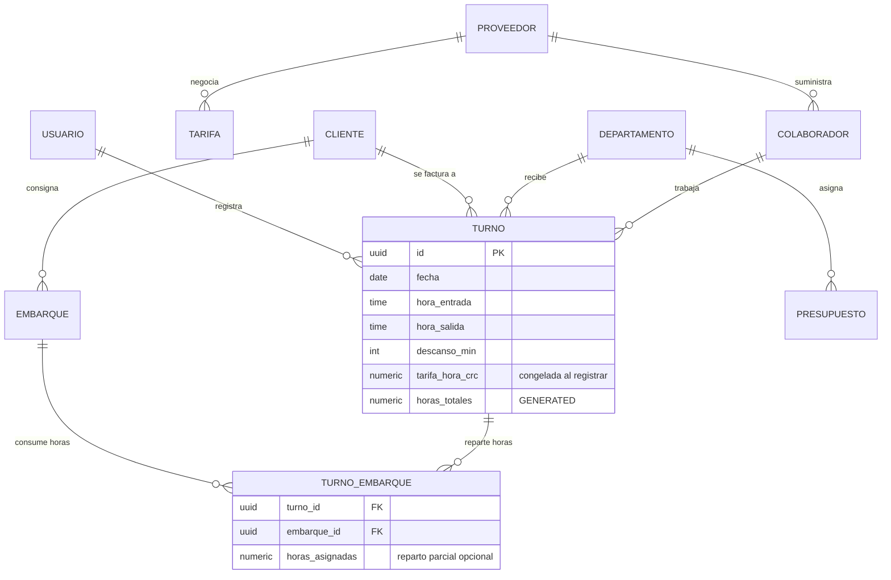

# CEDIS · Control de horas de personal externo
### Arquitectura, modelo de datos y lógica de negocio

Sistema para registrar y auditar las horas de terceros en descarga de contenedores, con ciclo operativo **viernes → jueves**, tarifa base **₡2.750/hora** y control contra presupuesto mensual.

---

## 1. Qué stack elegir

| Opción | Cuándo conviene | Costo | Esfuerzo |
|---|---|---|---|
| **A. React + PostgreSQL + Express** *(la que se entrega)* | El CEDIS ya tiene infra o quiere integrar con SAP/ERP. Control total, multiusuario real, auditoría fuerte. | ~US$20–40/mes (Railway, Render, Supabase) | 2–3 semanas para producción |
| **B. Google Apps Script + Sheets** *(también se entrega)* | Arranque rápido, presupuesto cero, finanzas quiere ver la hoja. Hasta ~50 mil filas cómodo. | US$0 con Workspace | 2–3 días |
| **C. AppSheet sobre Sheets** | Cero código, el supervisor ya usa el celular con la app de Google. | ~US$5/usuario/mes | 1–2 días |

La recomendación práctica: **arrancar con B** para validar la operación con los supervisores de patio durante un mes, y migrar a **A** cuando el volumen o la integración con contabilidad lo justifique. El esquema SQL y la API ya están escritos para que esa migración sea un `INSERT ... SELECT` desde la hoja.

Si se opta por **C (AppSheet)**, la configuración mínima es:

- Tabla `Turnos` con columnas `horas` y `costo_crc` como **virtual columns**:
  `horas` → `HOUR([salida]-[entrada]) + MINUTE([salida]-[entrada])/60 - [descanso_min]/60`
  `costo_crc` → `[horas] * 2750`
- Tabla `Turno_Embarque` como **child table** de `Turnos` (ref a `turno_id`), lo que resuelve los N embarques por turno con el formulario anidado nativo.
- Slice `Ciclo_Auditoria` con filtro:
  `AND([fecha] >= TODAY() - WEEKDAY(TODAY(), 6) - 7, [fecha] <= TODAY() - WEEKDAY(TODAY(), 6) - 1)`
- Vista de dashboard con agrupación por `cliente` y `departamento`, y un `Chart` de tipo columna sobre `costo_crc`.

---

## 2. Modelo de datos



### Las tres decisiones que sostienen todo el modelo

**Turno ↔ Embarque es N:M, no 1:N.** Un colaborador atiende tres contenedores en un turno y un contenedor lo descargan cinco personas. Meter el número de embarque como columna del turno obligaría a duplicar filas y rompería el conteo de horas. La tabla puente `turno_embarque` lleva además `horas_asignadas`, que permite costear por contenedor cuando el cliente pide el desglose, sin obligar a llenarlo cuando no hace falta.

**La tarifa se congela en el turno.** `turno.tarifa_hora_crc` guarda ₡2.750 al momento del registro. Cuando el proveedor renegocie a ₡2.900, los reportes de meses anteriores no se mueven. La tabla `tarifa` con `vigente_desde` / `vigente_hasta` mantiene el histórico y un trigger asigna la vigente si la API no la manda.

**`horas_totales` es columna generada, no calculada en la aplicación.** Si mañana entra un script de carga masiva o alguien edita por SQL, las horas siguen siendo correctas. La regla de cruce de medianoche vive en la base:

```sql
horas_totales numeric(6,2) GENERATED ALWAYS AS (
  round((
    ( EXTRACT(EPOCH FROM (hora_salida - hora_entrada))
      + CASE WHEN hora_salida <= hora_entrada THEN 86400 ELSE 0 END
      - descanso_min * 60 ) / 3600.0
  )::numeric, 2)
) STORED
```

### Reglas de integridad activas

| Regla | Dónde vive | Por qué |
|---|---|---|
| Las horas repartidas por embarque no exceden la jornada | trigger `tg_valida_reparto` (deferred) | Evita inflar el costeo por cuenta |
| Un colaborador no tiene dos turnos traslapados el mismo día | trigger `tg_sin_solape` | El error más común de digitación en patio |
| Un embarque es único por `(codigo, fecha_arribo)` | `UNIQUE` | Permite `ON CONFLICT DO UPDATE` al registrar |
| Descanso entre 0 y 480 minutos | `CHECK` | Corta dedazos tipo "300" en el campo de minutos |

---

## 3. Lógica de negocio

### 3.1 El ciclo viernes → jueves

Es la regla más particular del negocio y por eso está implementada una sola vez, idéntica en los tres lugares donde hace falta (SQL, API, front-end).

```js
const DIA_CORTE = 5;  // getDay(): 0=domingo … 5=viernes

function ciclo(fechaRef = new Date(), offset = 0) {
  const d = new Date(fechaRef); d.setHours(0,0,0,0);
  const atras = (d.getDay() - DIA_CORTE + 7) % 7;   // días desde el último viernes
  const inicio = sumaDias(d, -atras + offset * 7);  // viernes
  const fin    = sumaDias(inicio, 6);               // jueves
  return { desde: aISO(inicio), hasta: aISO(fin) };
}
```

```sql
CREATE FUNCTION inicio_ciclo(f date) RETURNS date
LANGUAGE sql IMMUTABLE AS $$
  SELECT f - ((EXTRACT(DOW FROM f)::int - 5 + 7) % 7);
$$;
```

**El detalle que importa:** el ciclo que corresponde auditar es **siempre `offset = -1`**, no "el anterior si hoy es viernes". Cualquier día de la semana, el ciclo `offset = 0` está abierto y el último cerrado es el `-1`. Si el auditor entra un lunes porque el viernes fue feriado, ve exactamente el mismo período que habría visto el viernes. La app abre en la pestaña **Semana** con ese ciclo preseleccionado.

El índice funcional `ix_turno_ciclo ON turno (inicio_ciclo(fecha))` hace que las consultas por ciclo no barran la tabla.

### 3.2 Horas y costo

```js
function horasTurno(entrada, salida, descansoMin = 0, bloqueMin = 15) {
  const [h1,m1] = entrada.split(":").map(Number);
  const [h2,m2] = salida.split(":").map(Number);
  let min = (h2*60 + m2) - (h1*60 + m1);
  if (min < 0) min += 1440;                      // el turno cruzó medianoche
  min = Math.max(0, min - descansoMin);
  min = Math.round(min / bloqueMin) * bloqueMin; // redondeo pactado con el proveedor
  return Math.round((min / 60) * 100) / 100;
}

const costoTurno = (horas, tarifa = 2750) => Math.round(horas * tarifa);
```

Tres cosas que este cálculo resuelve y que la resta simple no:

1. **Turnos nocturnos.** Un contenedor que entra a las 22:00 y se termina a las 06:00 son 8 horas, no −16. Ojo con el caso límite: entrada igual a salida son **cero** horas, no 24; casi siempre es un dedazo, y la base lo rechaza con el CHECK `turno_horas_distintas`.
2. **Tiempo no laborado.** El almuerzo se descuenta explícitamente. Sin este campo, la fuga de presupuesto se esconde en media hora por persona por día: con 8 personas diarias son ₡2,4 millones al año.
3. **Redondeo pactado.** El bloque de 15 minutos es configurable en Ajustes. Definilo en el contrato con el proveedor antes de operar, porque redondear al minuto exacto contra redondear a hora completa cambia la factura anual en un dígito porcentual.

El costo se redondea a colones enteros: en CRC no se factura con céntimos.

### 3.3 Proyección de demanda

El objetivo no es adivinar el futuro sino contestar una pregunta concreta del jueves: *¿cuánta gente pido para la semana entrante y cuánto me va a costar?*

```js
function proyectar(serie, semanas = 4, { alfa = 0.4, amort = 0.85, mezcla = 0.6 } = {}) {
  // 1. Regresión lineal por mínimos cuadrados sobre las últimas 4–8 semanas
  const b = (n*sxy - sx*sy) / (n*sxx - sx*sx);   // pendiente
  const a = (sy - b*sx) / n;                     // intercepto

  // 2. Suavizado exponencial: lo reciente pesa más
  let ewma = y[0];
  for (let i = 1; i < n; i++) ewma = alfa*y[i] + (1-alfa)*ewma;

  // 3. Amortiguación: la pendiente pierde 15 % de fuerza por semana proyectada
  for (let h = 1; h <= semanas; h++) {
    acum += Math.pow(amort, h);
    const valor = mezcla*(a + b*(n-1+h)) + (1-mezcla)*(ewma + b*acum);
    const margen = 1.28 * sigma * Math.sqrt(h);   // banda ~80 %
    puntos.push({ valor, min: valor - margen, max: valor + margen });
  }
}
```

| Componente | Qué aporta | Qué pasa si falta |
|---|---|---|
| Regresión lineal | La tendencia estructural: si el volumen de importación crece, el modelo lo sigue | Se proyecta el promedio y siempre queda corto en temporada alta |
| EWMA (α = 0,4) | Reacciona a un cambio de nivel reciente (un cliente nuevo, un turno que se abrió) | Tarda 6–8 semanas en enterarse |
| Amortiguación (φ = 0,85) | Impide que tres semanas buenas seguidas proyecten un crecimiento infinito | El pronóstico a 6 semanas se dispara |
| Banda ±1,28·σ·√h | Da el rango para negociar con el proveedor, no un número falsamente preciso | Se planifica sobre un punto que casi nunca se cumple |

La salida se traduce a lo que el supervisor necesita: **horas estimadas, costo en ₡ y número aproximado de personas** (`horas proyectadas ÷ horas promedio por persona en la ventana`).

**Límites honestos del modelo.** No incorpora estacionalidad anual (Navidad, entrada a clases, Semana Santa) porque para detectarla harían falta 2–3 años de historia; con 8 semanas no hay señal suficiente y forzarla produce ruido. Tampoco conoce el calendario de arribos del puerto. Si Caldera o Moín ya publicaron el ETA de los buques, ese dato vence a cualquier proyección estadística: la vista de proyección debería alimentarse de ahí en la fase 2 y usar este modelo solo como piso.

### 3.4 Presupuesto contra ejecución

```js
function ejecucion(gastado, presupuesto, ref = new Date()) {
  const dias = new Date(ref.getFullYear(), ref.getMonth()+1, 0).getDate();
  const ritmo = gastado / Math.max(1, ref.getDate());   // ₡ por día calendario
  const proyectado = ritmo * dias;                       // cierre estimado del mes
  const pProy = proyectado / presupuesto;
  return { ritmo, proyectado, pProy,
    estado: pProy > 1.05 ? "excedido" : pProy > 0.95 ? "limite" : "meta" };
}
```

La alerta no se dispara cuando el gasto supera el presupuesto —para eso ya sería tarde— sino cuando **el ritmo proyectado** lo supera. El día 12 con 40 % ejecutado, el semáforo ya está en rojo, y el mensaje traduce el sobregiro a la unidad que el supervisor controla: *"al ritmo actual el mes cierra ₡620.000 por encima, equivalentes a 225 horas de más"*.

Umbrales por defecto: verde bajo 95 %, amarillo entre 95 % y 105 %, rojo sobre 105 % del presupuesto proyectado. Son configurables en `COLOR_ESTADO` / `TEXTO_ESTADO`.

---

## 4. API

Base `/api`. Todos los montos en CRC enteros, fechas en `YYYY-MM-DD`, horas en `HH:MM` 24h.

| Método | Ruta | Devuelve |
|---|---|---|
| `GET` | `/catalogos` | Departamentos, clientes, colaboradores activos y tarifa vigente |
| `POST` | `/turnos` | Crea turno + N embarques en una transacción. Valida horas > 0 |
| `GET` | `/turnos?desde&hasta&cliente&departamento` | Detalle filtrado desde `v_turno` |
| `DELETE` | `/turnos/:id` | Elimina el turno y su reparto (cascade) |
| `GET` | `/ciclos/-1` | **Auditoría del viernes.** Resumen + desgloses por cliente, departamento y colaborador + detalle |
| `GET` | `/proyeccion?base=8&horizonte=4` | Serie histórica, pronóstico con banda, costo y personas estimadas |
| `PUT` | `/presupuestos/:anio/:mes` | Carga o actualiza el monto aprobado |
| `GET` | `/presupuestos/:anio/:mes` | Ejecución, disponible, ritmo, cierre proyectado y estado del semáforo |
| `GET` | `/exportar/-1.csv` | CSV con BOM y separador `;`, listo para Excel en español |

Ejemplo de registro con dos contenedores:

```bash
curl -X POST localhost:3000/api/turnos -H 'Content-Type: application/json' -d '{
  "fecha": "2026-08-27", "departamento_id": 2, "colaborador_id": 41, "cliente_id": 3,
  "hora_entrada": "07:00", "hora_salida": "16:30", "descanso_min": 30,
  "embarques": [
    { "codigo": "MSCU1234567", "horas": 5.5 },
    { "codigo": "TGHU9087654", "horas": 3.5 }
  ]
}'
```

---

## 5. Front-end

La aplicación entregada (`cedis-horas.jsx`) corre entera en el navegador con persistencia local, para que se pueda probar con supervisores reales antes de montar el backend. Para conectarla a la API basta sustituir las llamadas a `almacen.leer` / `almacen.escribir` por `fetch` a las rutas de arriba: la forma de los datos es la misma.

**Cuatro pestañas, una por momento del día operativo:**

- **Registrar** — el supervisor de patio, en el celular, con una mano. Departamento por chips (no dropdown), horas con el selector nativo del sistema, embarques como filas que se agregan, y el botón *Repartir horas en partes iguales* para el caso del 80 %. El cálculo de horas y colones se actualiza mientras escribe, así que el error se ve antes de guardar, no en la auditoría del viernes.
- **Semana** — el ciclo cerrado, con flechas para navegar hacia atrás, comparación contra el ciclo previo y exportación a CSV.
- **Tablero** — presupuesto con semáforo, proyección con banda de incertidumbre e histórico mensual.
- **Ajustes** — tarifa, redondeo, catálogos y presupuestos por mes.

**El elemento que organiza toda la interfaz** es la *cinta del ciclo*: una franja de siete celdas, viernes a jueves, con las horas de cada día en barras y el corchete amarillo marcando el inicio del período. Está fija bajo el encabezado en las pantallas de registro y tablero. La regla de negocio más particular del sistema —que la semana no empieza el lunes— deja de ser algo que hay que recordar y pasa a estar siempre a la vista.

El amarillo de seguridad se usa **solo** como señal: el corchete del ciclo, la pestaña activa y el botón que confirma. Nunca decorativo. Los datos van en azul acero, el sobregiro en rojo, y todo lo demás en gris concreto.

Accesibilidad y campo: tipografía de 16 px en los inputs (evita el zoom automático de iOS), objetivos táctiles de 44 px, foco visible con contorno amarillo, tabla con scroll horizontal en móvil y `prefers-reduced-motion` respetado.

---

## 6. Despliegue

**Opción A (React + Postgres)**

```bash
# Base de datos
psql "$DATABASE_URL" -f esquema.sql

# API
npm i express pg cors
DATABASE_URL=postgres://… PORT=3000 node servidor.js

# Front-end
npm create vite@latest cedis -- --template react
npm i recharts
# copiar cedis-horas.jsx como src/App.jsx
npm run build   # servir dist/ desde Nginx, Vercel o el mismo Express
```

Hosting sugerido para Costa Rica: **Supabase** (Postgres administrado con backups) + **Vercel** para el front. Latencia desde CR aceptable en las regiones `us-east`.

**Opción B (Apps Script)** — pasos en el encabezado de `apps-script.gs`. Ejecutar `instalar()` una vez crea las hojas, el formato y el disparador que envía el correo de auditoría todos los viernes a las 7:00 con el resumen del ciclo cerrado y la proyección a 4 semanas.

---

## 7. Qué falta antes de producción

1. **Autenticación.** La API no valida sesión. Con Supabase, activar RLS y filtrar por `auth.uid()`; en Express, agregar JWT y verificar el rol de `usuario` en cada ruta de escritura.
2. **Modo sin conexión.** El patio de un CEDIS es donde peor entra la señal. Un service worker con cola de escrituras evita que el supervisor pierda el registro y lo digite dos horas después de memoria.
3. **Firma del colaborador.** Un campo de firma en pantalla al cerrar el turno reduce la disputa con el proveedor cuando la factura no cuadra. En Costa Rica no es requisito legal para servicios contratados a un tercero, pero sí es la prueba práctica que evita la discusión.
4. **Bitácora de cambios.** Una tabla `turno_auditoria` con trigger que registre quién editó qué y cuándo. Sin esto, un turno modificado después del cierre semanal es invisible.
5. **Estacionalidad en la proyección.** Con 2–3 años de historia se puede pasar a Holt-Winters con período anual, o simplemente cargar el calendario de arribos del puerto y usarlo como dato duro.
6. **Conciliación contra la factura del proveedor.** El siguiente paso natural: cargar el detalle facturado y contrastarlo línea por línea contra los turnos registrados. Ahí es donde este sistema termina de pagarse solo.

> Nota: el punto 3 y cualquier cláusula sobre redondeo, mínimos por jornada o recargos nocturnos conviene revisarlos con el asesor legal o contable de la empresa antes de fijarlos en el sistema. No soy abogado ni contador; el sistema implementa la regla que se le configure.
